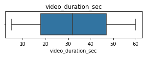
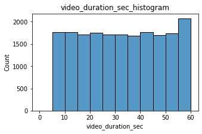
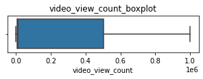
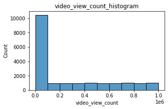
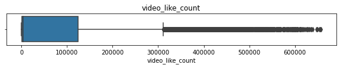
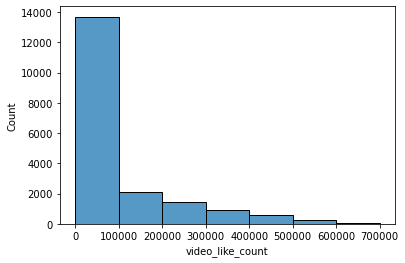
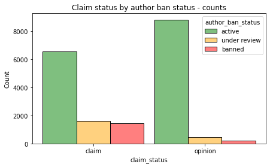
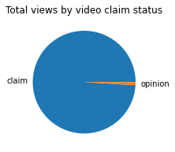
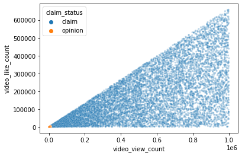

# **TikTok Project**
**Course 3 - Go Beyond the Numbers: Translate Data into Insights**

Your TikTok data team is still in the early stages of their latest project. So far, you’ve completed a project proposal and used Python to inspect and organize the TikTok dataset.

Orion Rainier, a Data Scientist at TikTok, is pleased with the work you have already completed and is requesting your assistance with some Exploratory Data Analysis (EDA) and data visualization. The management team asked to see a Python notebook showing data structuring and cleaning, as well as any matplotlib/seaborn visualizations plotted to help us understand the data. At the very least, include a graph comparing claim counts to opinion counts, as well as boxplots of the most important variables (like “video duration,” “video like count,” “video comment count,” and “video view count”) to check for outliers. Also, include a breakdown of “author ban status” counts.

Additionally, the management team has recently asked all EDA to include Tableau visualizations. Tableau visualizations are particularly helpful in status reports to the client and board members. For this data, create a Tableau dashboard showing a simple claims versus opinions count, as well as stacked bar charts of claims versus opinions for variables like video view counts, video like counts, video share counts, and video download counts. Make sure it is easy to understand to someone who isn’t data savvy, and remember that the assistant director is a person with visual impairments.

You also notice a follow-up email from the Data Science Lead, Willow Jaffey. Willow suggests including an executive summary of your analysis to share with teammates.

A notebook was structured and prepared to help you in this project. Please complete the following questions.

# **Course 3 End-of-course project: Exploratory data analysis**

In this activity, you will examine data provided and prepare it for analysis. You will also design a professional data visualization that tells a story, and will help data-driven decisions for business needs.

Please note that the Tableau visualization activity is optional, and will not affect your completion of the course. Completing the Tableau activity will help you practice planning out and plotting a data visualization based on a specific business need. The structure of this activity is designed to emulate the proposals you will likely be assigned in your career as a data professional. Completing this activity will help prepare you for those career moments.
<br/>

**The purpose** of this project is to conduct exploratory data analysis on a provided data set. Your mission is to continue the investigation you began in C2 and perform further EDA on this data with the aim of learning more about the variables. Of particular interest is information related to what distinguishes claim videos from opinion videos.

**The goal** is to explore the dataset and create visualizations.
<br/>
*This activity has 4 parts:*

**Part 1:** Imports, links, and loading

**Part 2:** Data Exploration
*   Data cleaning


**Part 3:** Build visualizations

**Part 4:** Evaluate and share results

Follow the instructions and answer the question below to complete the activity. Then, you will complete an executive summary using the questions listed on the PACE Strategy Document.

Be sure to complete this activity before moving on. The next course item will provide you with a completed exemplar to compare to your own work.

# **Visualize a story in Tableau and Python**


# **PACE stages**

Throughout these project notebooks, you'll see references to the problem-solving framework PACE. The following notebook components are labeled with the respective PACE stage: Plan, Analyze, Construct, and Execute.


## **PACE: Plan**

Consider the questions in your PACE Strategy Document and those below where applicable to craft your response:
1. Identify any outliers:


*   What methods are best for identifying outliers?
*   How do you make the decision to keep or exclude outliers from any future models?


What methods are best for identifying outliers?

Use numpy functions to investigate the mean() and median() of the data and understand range of data values
Use a boxplot to visualize the distribution of the data
How do you make the decision to keep or exclude outliers from any future models?

There are three main options for dealing with outliers: keeping them as they are, deleting them, or reassigning them. Whether you keep outliers as they are, delete them, or reassign values is a decision that you make on a dataset-by-dataset basis, according to what your goals are for the model you are planning to construct. To help you make the decision, you can start with these general guidelines:

Delete them: If you are sure the outliers are mistakes, typos, or errors and the dataset will be used for modeling or machine learning, then you are more likely to decide to delete outliers. Of the three choices, you’ll use this one the least.
Reassign them: If the dataset is small and/or the data will be used for modeling or machine learning, you are more likely to choose a path of deriving new values to replace the outlier values.
Leave them: For a dataset that you plan to do EDA/analysis on and nothing else, or for a dataset you are preparing for a model that is resistant to outliers, it is most likely that you are going to leave them in.

### **Task 1. Imports, links, and loading**
Go to Tableau Public
The following link will help you complete this activity. Keep Tableau Public open as you proceed to the next steps.

Link to supporting materials:
Public Tableau: https://public.tableau.com/s/. Note that the TikTok dataset can be downloaded directly from this notebook by going to "Lab Files" in the menu bar at the top of the page, clicking into the "/home/jovyan/work" folder, selecting `tiktok_dataset.csv`, and clicking "Download" above the list of files. 

For EDA of the data, import the packages that would be most helpful, such as `pandas`, `numpy`, `matplotlib.pyplot`, and `seaborn`.


```python
# Import packages for data manipulation
### YOUR CODE HERE ###
import pandas as pd
import numpy as np

# Import packages for data visualization
import matplotlib.pyplot as plt
import seaborn as sns
```

Then, load the dataset into a dataframe. Read in the data and store it as a dataframe object.

**Note:** As shown in this cell, the dataset has been automatically loaded in for you. You do not need to download the .csv file, or provide more code, in order to access the dataset and proceed with this lab. Please continue with this activity by completing the following instructions.


```python
# Load dataset into dataframe
data = pd.read_csv("tiktok_dataset.csv")
```


## **PACE: Analyze**

Consider the questions in your PACE Strategy Document and those below where applicable to complete your code.

### **Task 2a: Data exploration and cleaning**

The first step is to assess your data. Check the Data Source page on Tableau Public to get a sense of the size, shape and makeup of the data set.

Consider functions that help you understand and structure the data.

*    `.head()`
*    `.info()`
*    `.describe()`
*    `.groupby()`
*    `.sort_values()`

Consider the following questions as you work:

What do you do about missing data (if any)?

Are there data outliers?

Start by discovering, using `.head()`, `.size`, and `.shape`.


```python
# Display and examine the first few rows of the dataframe
### YOUR CODE HERE ###
data.head()
```


<div>
<style scoped>
    .dataframe tbody tr th:only-of-type {
        vertical-align: middle;
    }

    .dataframe tbody tr th {
        vertical-align: top;
    }

    .dataframe thead th {
        text-align: right;
    }
</style>
<table border="1" class="dataframe">
  <thead>
    <tr style="text-align: right;">
      <th></th>
      <th>#</th>
      <th>claim_status</th>
      <th>video_id</th>
      <th>video_duration_sec</th>
      <th>video_transcription_text</th>
      <th>verified_status</th>
      <th>author_ban_status</th>
      <th>video_view_count</th>
      <th>video_like_count</th>
      <th>video_share_count</th>
      <th>video_download_count</th>
      <th>video_comment_count</th>
    </tr>
  </thead>
  <tbody>
    <tr>
      <th>0</th>
      <td>1</td>
      <td>claim</td>
      <td>7017666017</td>
      <td>59</td>
      <td>someone shared with me that drone deliveries a...</td>
      <td>not verified</td>
      <td>under review</td>
      <td>343296.0</td>
      <td>19425.0</td>
      <td>241.0</td>
      <td>1.0</td>
      <td>0.0</td>
    </tr>
    <tr>
      <th>1</th>
      <td>2</td>
      <td>claim</td>
      <td>4014381136</td>
      <td>32</td>
      <td>someone shared with me that there are more mic...</td>
      <td>not verified</td>
      <td>active</td>
      <td>140877.0</td>
      <td>77355.0</td>
      <td>19034.0</td>
      <td>1161.0</td>
      <td>684.0</td>
    </tr>
    <tr>
      <th>2</th>
      <td>3</td>
      <td>claim</td>
      <td>9859838091</td>
      <td>31</td>
      <td>someone shared with me that american industria...</td>
      <td>not verified</td>
      <td>active</td>
      <td>902185.0</td>
      <td>97690.0</td>
      <td>2858.0</td>
      <td>833.0</td>
      <td>329.0</td>
    </tr>
    <tr>
      <th>3</th>
      <td>4</td>
      <td>claim</td>
      <td>1866847991</td>
      <td>25</td>
      <td>someone shared with me that the metro of st. p...</td>
      <td>not verified</td>
      <td>active</td>
      <td>437506.0</td>
      <td>239954.0</td>
      <td>34812.0</td>
      <td>1234.0</td>
      <td>584.0</td>
    </tr>
    <tr>
      <th>4</th>
      <td>5</td>
      <td>claim</td>
      <td>7105231098</td>
      <td>19</td>
      <td>someone shared with me that the number of busi...</td>
      <td>not verified</td>
      <td>active</td>
      <td>56167.0</td>
      <td>34987.0</td>
      <td>4110.0</td>
      <td>547.0</td>
      <td>152.0</td>
    </tr>
  </tbody>
</table>
</div>


```python
# Get the size of the data
### YOUR CODE HERE ###
data.size
```


    232584


```python
# Get the shape of the data
### YOUR CODE HERE ###
data.shape

```


    (19382, 12)


Get basic information about the data, using `.info()`.


```python
# Get basic information about the data
### YOUR CODE HERE ###
data.info()
```

    <class 'pandas.core.frame.DataFrame'>
    RangeIndex: 19382 entries, 0 to 19381
    Data columns (total 12 columns):
     #   Column                    Non-Null Count  Dtype  
    ---  ------                    --------------  -----  
     0   #                         19382 non-null  int64  
     1   claim_status              19084 non-null  object 
     2   video_id                  19382 non-null  int64  
     3   video_duration_sec        19382 non-null  int64  
     4   video_transcription_text  19084 non-null  object 
     5   verified_status           19382 non-null  object 
     6   author_ban_status         19382 non-null  object 
     7   video_view_count          19084 non-null  float64
     8   video_like_count          19084 non-null  float64
     9   video_share_count         19084 non-null  float64
     10  video_download_count      19084 non-null  float64
     11  video_comment_count       19084 non-null  float64
    dtypes: float64(5), int64(3), object(4)
    memory usage: 1.8+ MB


Generate a table of descriptive statistics, using `.describe()`.


```python
# Generate a table of descriptive statistics
### YOUR CODE HERE ###
data.describe()
```


<div>
<style scoped>
    .dataframe tbody tr th:only-of-type {
        vertical-align: middle;
    }

    .dataframe tbody tr th {
        vertical-align: top;
    }

    .dataframe thead th {
        text-align: right;
    }
</style>
<table border="1" class="dataframe">
  <thead>
    <tr style="text-align: right;">
      <th></th>
      <th>#</th>
      <th>video_id</th>
      <th>video_duration_sec</th>
      <th>video_view_count</th>
      <th>video_like_count</th>
      <th>video_share_count</th>
      <th>video_download_count</th>
      <th>video_comment_count</th>
    </tr>
  </thead>
  <tbody>
    <tr>
      <th>count</th>
      <td>19382.000000</td>
      <td>1.938200e+04</td>
      <td>19382.000000</td>
      <td>19084.000000</td>
      <td>19084.000000</td>
      <td>19084.000000</td>
      <td>19084.000000</td>
      <td>19084.000000</td>
    </tr>
    <tr>
      <th>mean</th>
      <td>9691.500000</td>
      <td>5.627454e+09</td>
      <td>32.421732</td>
      <td>254708.558688</td>
      <td>84304.636030</td>
      <td>16735.248323</td>
      <td>1049.429627</td>
      <td>349.312146</td>
    </tr>
    <tr>
      <th>std</th>
      <td>5595.245794</td>
      <td>2.536440e+09</td>
      <td>16.229967</td>
      <td>322893.280814</td>
      <td>133420.546814</td>
      <td>32036.174350</td>
      <td>2004.299894</td>
      <td>799.638865</td>
    </tr>
    <tr>
      <th>min</th>
      <td>1.000000</td>
      <td>1.234959e+09</td>
      <td>5.000000</td>
      <td>20.000000</td>
      <td>0.000000</td>
      <td>0.000000</td>
      <td>0.000000</td>
      <td>0.000000</td>
    </tr>
    <tr>
      <th>25%</th>
      <td>4846.250000</td>
      <td>3.430417e+09</td>
      <td>18.000000</td>
      <td>4942.500000</td>
      <td>810.750000</td>
      <td>115.000000</td>
      <td>7.000000</td>
      <td>1.000000</td>
    </tr>
    <tr>
      <th>50%</th>
      <td>9691.500000</td>
      <td>5.618664e+09</td>
      <td>32.000000</td>
      <td>9954.500000</td>
      <td>3403.500000</td>
      <td>717.000000</td>
      <td>46.000000</td>
      <td>9.000000</td>
    </tr>
    <tr>
      <th>75%</th>
      <td>14536.750000</td>
      <td>7.843960e+09</td>
      <td>47.000000</td>
      <td>504327.000000</td>
      <td>125020.000000</td>
      <td>18222.000000</td>
      <td>1156.250000</td>
      <td>292.000000</td>
    </tr>
    <tr>
      <th>max</th>
      <td>19382.000000</td>
      <td>9.999873e+09</td>
      <td>60.000000</td>
      <td>999817.000000</td>
      <td>657830.000000</td>
      <td>256130.000000</td>
      <td>14994.000000</td>
      <td>9599.000000</td>
    </tr>
  </tbody>
</table>
</div>


### **Task 2b. Assess data types**

In Tableau, staying on the data source page, double check the data types of the columns in the dataset. Refer to the dimensions and measures in Tableau.


Review the instructions linked in the previous Activity document to create the required Tableau visualization.

### **Task 2c. Select visualization type(s)**

Select data visualization types that will help you understand and explain the data.

Now that you know which data columns you’ll use, it is time to decide which data visualization makes the most sense for EDA of the TikTok dataset. What type of data visualization(s) would be most helpful? Consider the distribution of the data.

* Line graph
* Bar chart
* Box plot
* Histogram
* Heat map
* Scatter plot
* A geographic map


The visualizations most helpful for considering the distribution of the data include box plots and histograms. Visualizing the distribution of the data can inform the next steps and considerations in data analysis. For example, data distribution will inform which types of modeling is needed.


## **PACE: Construct**

Consider the questions in your PACE Strategy Document to reflect on the Construct stage.

### **Task 3. Build visualizations**

Now that you have assessed your data, it’s time to plot your visualization(s).

#### **video_duration_sec**

Create a box plot to examine the spread of values in the `video_duration_sec` column.


```python
# Create a boxplot to visualize distribution of `video_duration_sec`
### YOUR CODE HERE ###
plt.figure(figsize=(5,1))
plt.title('video_duration_sec')
sns.boxplot(x=data['video_duration_sec']);

```





Create a histogram of the values in the `video_duration_sec` column to further explore the distribution of this variable.


```python
# Create a histogram
### YOUR CODE HERE ###
plt.figure(figsize=(5,3))
plt.title('video_duration_sec_histogram')
sns.histplot(x=data['video_duration_sec'], bins=range(0,61,5));
```





**Question:** What do you notice about the duration and distribution of the videos?

**Answer:** The distribution is flat and there are videos ranging from 5 seconds to 60 seconds.
From the above image we can see that the histogram is rather flat but has only one high point at 60 seconds duration, which means there are more videos of almost 60 seconds than other durations. 

#### **video_view_count**

Create a box plot to examine the spread of values in the `video_view_count` column.


```python
# Create a boxplot to visualize distribution of `video_view_count`
### YOUR CODE HERE ###
plt.figure(figsize=(5,1))
plt.title('video_view_count_boxplot')
sns.boxplot(x=data['video_view_count']);

```





Create a histogram of the values in the `video_view_count` column to further explore the distribution of this variable.


```python
# Create a histogram
### YOUR CODE HERE ###
plt.figure(figsize=(5,3))
plt.title('video_view_count_histogram')
sns.histplot(x=data['video_view_count'], bins=range(0,(10**6+1),10**5));
```





**Question:** What do you notice about the distribution of this variable?

**Ansawer:**  The distribution of this variable is very uneven distribution, with more than half the videos receiving fewer than 100,000 views. Distribution of view counts > 100,000 views is uniform.


#### **video_like_count**

Create a box plot to examine the spread of values in the `video_like_count` column.


```python
# Create a boxplot to visualize distribution of `video_like_count`
### YOUR CODE HERE ###
plt.figure(figsize=(10,1))
plt.title('video_like_count')
sns.boxplot(x=data['video_like_count']);
```





Create a histogram of the values in the `video_like_count` column to further explore the distribution of this variable.


```python
# Create a histogram
### YOUR CODE HERE ###
ax = sns.histplot(data['video_like_count'], bins=range(0,(7*10**5+1),10**5))
ax.set_xticks(range(0,7*10**5+1,10**5), labels=labels)
plt.title('Video like count histogram');
```


    ---------------------------------------------------------------------------

    NameError                                 Traceback (most recent call last)

    <ipython-input-13-ca845141bf0c> in <module>
          2 ### YOUR CODE HERE ###
          3 ax = sns.histplot(data['video_like_count'], bins=range(0,(7*10**5+1),10**5))
    ----> 4 ax.set_xticks(range(0,7*10**5+1,10**5), labels=labels)
          5 plt.title('Video like count histogram');


    NameError: name 'labels' is not defined





**Question:** What do you notice about the distribution of this variable?

**Answer**  The above histogram shows that there are more videos with very high or more than 12000 likes and very few videos with less likes. the disribution is very uneven with more on the higher count side.

#### **video_comment_count**

Create a box plot to examine the spread of values in the `video_comment_count` column.


```python
# Create a boxplot to visualize distribution of `video_comment_count`
### YOUR CODE HERE ###
plt.figure(figsize=(5,1))
plt.title('video_comment_count')
sns.boxplot(x=data['video_comment_count']);

```

Create a histogram of the values in the `video_comment_count` column to further explore the distribution of this variable.


```python
# Create a histogram
### YOUR CODE HERE ###
plt.figure(figsize=(5,3))
sns.histplot(data['video_comment_count'], bins=range(0,(3001),100))
plt.title('Video comment count histogram');
```

**Question:** What do you notice about the distribution of this variable?

**Answer:**  From the above histogram we can see that the distribution is very uneven and skewed towards the right and that denotes there are many videos with lower comment count. Most of the videos lie at the bottom end of the counts. 

#### **video_share_count**

Create a box plot to examine the spread of values in the `video_share_count` column.


```python
# Create a boxplot to visualize distribution of `video_share_count`
### YOUR CODE HERE ###
plt.figure(figsize=(5,1))
plt.title('video_share_count_boxplot')
sns.boxplot(x=data['video_share_count']);
```

*Create* a histogram of the values in the `video_share_count` column to further explore the distribution of this variable.


```python
# Create a histogram
### YOUR CODE HERE ###
plt.figure(figsize=(5,3))
sns.histplot(data['video_share_count'], bins=range(0,(3001),100))
plt.title('video_share_count_histogram');
```

**Question:** What do you notice about the distribution of this variable?
**Answer:**  The distribution is very uneven and it is skewed towards the right, most of the values lie at the bottom end and most videos have less than 10000 shares.

#### **video_download_count**

Create a box plot to examine the spread of values in the `video_download_count` column.


```python
# Create a boxplot to visualize distribution of `video_download_count`
### YOUR CODE HERE ###
plt.figure(figsize=(5,1))
plt.title('video_download_count')
sns.boxplot(x=data['video_download_count']);
```

Create a histogram of the values in the `video_download_count` column to further explore the distribution of this variable.


```python
# Create a histogram
### YOUR CODE HERE ###
plt.figure(figsize=(5,3))
sns.histplot(data['video_download_count'], bins=range(0,(15001),500))
plt.title('Video comment download histogram');
```

**Question:** What do you notice about the distribution of this variable?

**Answer:**  The majority of videos were downloaded fewer than 500 times, but some were downloaded over 12,000 times. Again, the data is very skewed to the right.

#### **Claim status by verification status**

Now, create a histogram with four bars: one for each combination of claim status and verification status.


```python
# Create a histogram
### YOUR CODE HERE ###
plt.figure(figsize=(7,4))
sns.histplot(data=data,
             x='claim_status',
             hue='verified_status',
             multiple='dodge',
             shrink=0.9)
plt.title('Claims by verification status histogram');
```

**Question:** What do you notice about the number of verified users compared to unverified? And how does that affect their likelihood to post opinions?

**Answer:**  The number of non verified user is much more than the number of verified users, but most verified user are likely to post opinions.

#### **Claim status by author ban status**

The previous course used a `groupby()` statement to examine the count of each claim status for each author ban status. Now, use a histogram to communicate the same information.


```python
# Create a histogram
### YOUR CODE HERE ###
fig = plt.figure(figsize=(7,4))
sns.histplot(data, x='claim_status', hue='author_ban_status',
             multiple='dodge',
             hue_order=['active', 'under review', 'banned'],
             shrink=0.9,
             palette={'active':'green', 'under review':'orange', 'banned':'red'},
             alpha=0.5)
plt.title('Claim status by author ban status - counts');
```





**Question:** What do you notice about the number of active authors compared to banned authors for both claims and opinions?

**Answer:**  For both claims and opinions, there are many more active authors than banned authors or authors under review, The number of active authors compared to banned authors is higher for opinions & lower for claims. Again, it seems that authors who post claim videos are more likely to come under review and/or get banned.

#### **Median view counts by ban status**

Create a bar plot with three bars: one for each author ban status. The height of each bar should correspond with the median number of views for all videos with that author ban status.


```python
# Create a bar plot
### YOUR CODE HERE ###
ban_status_counts = data.groupby(['author_ban_status']).median(
    numeric_only=True).reset_index()

fig = plt.figure(figsize=(5,3))
sns.barplot(data=ban_status_counts,
            x='author_ban_status',
            y='video_view_count',
            order=['active', 'under review', 'banned'],
            palette={'active':'green', 'under review':'orange', 'banned':'red'},
            alpha=0.5)
plt.title('Median view count by ban status');
```


**Question:** What do you notice about the median view counts for non-active authors compared to that of active authors? Based on that insight, what variable might be a good indicator of claim status?

**Answer:**  The median view count is very high for non active authors compared to active authors, Since we know that non-active authors are more likely to post claims, and that videos by non-active authors get far more views on aggregate than videos by active authors, then `video_view_count` might be a good indicator of claim status.


```python
# Calculate the median view count for claim status.
### YOUR CODE HERE ###
data.groupby('claim_status')['video_view_count'].median()
```


    claim_status
    claim      501555.0
    opinion      4953.0
    Name: video_view_count, dtype: float64


#### **Total views by claim status**

Create a pie graph that depicts the proportions of total views for claim videos and total views for opinion videos.


```python
# Create a pie graph
### YOUR CODE HERE ###
fig = plt.figure(figsize=(3,3))
plt.pie(data.groupby('claim_status')['video_view_count'].sum(), labels=['claim', 'opinion'])
plt.title('Total views by video claim status');
```





**Question:** What do you notice about the overall view count for claim status?
**Answer:**  The overal views are significantly higher for the claim videos when compared to the opinions even though there are roughly the same number of each video in the dataset.

### **Task 4. Determine outliers**

When building predictive models, the presence of outliers can be problematic. For example, if you were trying to predict the view count of a particular video, videos with extremely high view counts might introduce bias to a model. Also, some outliers might indicate problems with how data was captured or recorded.

The ultimate objective of the TikTok project is to build a model that predicts whether a video is a claim or opinion. The analysis you've performed indicates that a video's engagement level is strongly correlated with its claim status. There's no reason to believe that any of the values in the TikTok data are erroneously captured, and they align with expectation of how social media works: a very small proportion of videos get super high engagement levels. That's the nature of viral content.

Nonetheless, it's good practice to get a sense of just how many of your data points could be considered outliers. The definition of an outlier can change based on the details of your project, and it helps to have domain expertise to decide a threshold. You've learned that a common way to determine outliers in a normal distribution is to calculate the interquartile range (IQR) and set a threshold that is 1.5 * IQR above the 3rd quartile.

In this TikTok dataset, the values for the count variables are not normally distributed. They are heavily skewed to the right. One way of modifying the outlier threshold is by calculating the **median** value for each variable and then adding 1.5 * IQR. This results in a threshold that is, in this case, much lower than it would be if you used the 3rd quartile.

Write a for loop that iterates over the column names of each count variable. For each iteration:
1. Calculate the IQR of the column
2. Calculate the median of the column
3. Calculate the outlier threshold (median + 1.5 * IQR)
4. Calculate the numer of videos with a count in that column that exceeds the outlier threshold
5. Print "Number of outliers, {column name}: {outlier count}"

```
Example:
Number of outliers, video_view_count: ___
Number of outliers, video_like_count: ___
Number of outliers, video_share_count: ___
Number of outliers, video_download_count: ___
Number of outliers, video_comment_count: ___
```


```python
### YOUR CODE HERE ###

count_cols = ['video_view_count',
              'video_like_count',
              'video_share_count',
              'video_download_count',
              'video_comment_count',
              ]

for column in count_cols:
    q1 = data[column].quantile(0.25)
    q3 = data[column].quantile(0.75)
    iqr = q3 - q1
    median = data[column].median()
    outlier_threshold = median + 1.5*iqr

    # Count the number of values that exceed the outlier threshold
    outlier_count = (data[column] > outlier_threshold).sum()
    print(f'Number of outliers, {column}:', outlier_count)
```

    Number of outliers, video_view_count: 2343
    Number of outliers, video_like_count: 3468
    Number of outliers, video_share_count: 3732
    Number of outliers, video_download_count: 3733
    Number of outliers, video_comment_count: 3882


#### **Scatterplot**


```python
# Create a scatterplot of `video_view_count` versus `video_like_count` according to 'claim_status'
### YOUR CODE HERE ###
sns.scatterplot(x=data["video_view_count"], y=data["video_like_count"],
                hue=data["claim_status"], s=10, alpha=.3)
plt.show()
```





```python
# Create a scatterplot of ``video_view_count` versus `video_like_count` for opinions only
### YOUR CODE HERE ###
opinion = data[data['claim_status']=='opinion']
sns.scatterplot(x=opinion["video_view_count"], y=opinion["video_like_count"],
                 s=10, alpha=.3)
plt.show()

```


You can do a scatterplot in Tableau Public as well, which can be easier to manipulate and present. If you'd like step by step instructions, you can review the instructions linked in the previous Activity page.


## **PACE: Execute**

Consider the questions in your PACE Strategy Document to reflect on the Execute stage.

### **Task 5a. Results and evaluation**

Having built visualizations in Tableau and in Python, what have you learned about the dataset? What other questions have your visualizations uncovered that you should pursue?

***Pro tip:*** Put yourself in your client's perspective, what would they want to know?

Use the following code cells to pursue any additional EDA. Also use the space to make sure your visualizations are clean, easily understandable, and accessible.

***Ask yourself:*** Did you consider color, contrast, emphasis, and labeling?


==> ENTER YOUR RESPONSE HERE

I have learned .... 

    How to create visualizations to find outliers in your data and perform EDA on a dataset to make it clean and organized and I examined the data distribution/spread, count frequencies, mean and median values, extreme values/outliers, missing data, and more. I analyzed correlations between variables, particularly between the claim_status variable and others.

My other questions are ....

    I want to further investigate distinctive characteristics that apply only to claims or only to opinions. Also, I want to consider other variables that might be helpful in understanding the data.

My client would likely want to know ...

    My client would want to know the assumptions regarding what data might be predictive of claim_status.


### **Task 5b. Conclusion**
*Make it professional and presentable*

You have visualized the data you need to share with the director now. Remember, the goal of a data visualization is for an audience member to glean the information on the chart in mere seconds.

*Questions to ask yourself for reflection:*
Why is it important to conduct Exploratory Data Analysis? What other visuals could you create?


EDA is important because ...

EDA is very important because it lets you have a clean and organized dataset for your analysis, EDA helps us remove outliers from the data which can be very dangerous and create bias in our model at a later stage. EDA also helps us clean the missing values, and prepare data for future modeling.

Visualizations helped me understand ..

Visualization helps me understand the data in a better way by plotting different graphs which helped us get an idea of the data distributions and skew. Also, that we will need to make decisions on certain considerations prior to designing a model. (for example, what to do with outliers, duplicate values, or missing data)

You’ve now completed a professional data visualization according to a business need. Well done! Be sure to save your work as a reference for later work in Tableau.

**Congratulations!** You've completed this lab. However, you may not notice a green check mark next to this item on Coursera's platform. Please continue your progress regardless of the check mark. Just click on the "save" icon at the top of this notebook to ensure your work has been logged.
